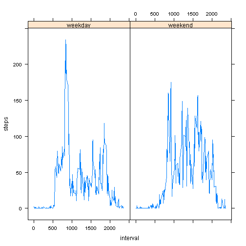

# Loading and preprocessing the data


```r
activity <- read.csv("activity.csv", colClass=c('integer', 'Date', 'integer'))
```

# What is mean total number of steps taken per day?


```r
steps.date <- aggregate(steps ~ date, activity, sum)
head(steps.date)
```

```
##         date steps
## 1 2012-10-02   126
## 2 2012-10-03 11352
## 3 2012-10-04 12116
## 4 2012-10-05 13294
## 5 2012-10-06 15420
## 6 2012-10-07 11015
```

Histogram of the total number of steps taken each day

```r
barplot(steps.date$steps, names.arg=steps.date$date, ylim=c(0, 25000), 
        xlab="date", ylab="sum(steps)",)
```

 

Mean of total number of steps taken per day


```r
mean(steps.date$steps)
```

```
## [1] 10766.19
```

Median of total number of steps taken per day


```r
median(steps.date$steps)
```

```
## [1] 10765
```

# What is the average daily activity pattern?

Time series plot of the 5-minute interval and average number of steps taken averaged across all days


```r
steps.interval <- aggregate(steps ~ interval, activity, mean)
plot(steps.interval, type='l')
```

 

The 5-minute interval contains the maximum number of steps


```r
steps.interval$interval[which.max(steps.interval$steps)]
```

```
## [1] 835
```

# Imputing missing values

The total number of missing values in the dataset is


```r
sum(is.na(activity$steps))
```

```
## [1] 2304
```

The strategy for filling in all of the missing values in the dataset is to use mean of the day.

Create a new dataset that is equal to the original dataset but with the missing data filled in.


```r
activity.clean <- merge(activity, steps.date, by="date", suffixes=c("", ".mean"))
nas <- is.na(activity.clean$steps)
activity.clean$steps[nas] <- activity.clean$steps.mean[nas]
activity.clean <- activity.clean[, c(1:3)]
head(activity.clean)
```

```
##         date steps interval
## 1 2012-10-02     0     1740
## 2 2012-10-02     0     1715
## 3 2012-10-02     0     1725
## 4 2012-10-02     0     1710
## 5 2012-10-02     0     1735
## 6 2012-10-02     0     1855
```

Histogram of the total number of steps taken each day


```r
steps.date <- aggregate(steps ~ date, activity.clean, sum)
barplot(steps.date$steps, names.arg=steps.date$date, ylim=c(0, 25000), 
        xlab="date", ylab="sum(steps)",)
```

 

Mean of total number of steps taken per day

```r
mean(steps.date$steps)
```

```
## [1] 10766.19
```

Median of total number of steps taken per day

```r
median(steps.date$steps)
```

```
## [1] 10765
```

Data don't appear to be significant different because imputation uses mean for that particular day.

# Are there differences in activity patterns between weekdays and weekends?
Add new factor variable dayType with 2 levels - "weekday" and "weekend"


```r
dayType <- function(dates) {
  f <- function(date) {
    if (weekdays(date) %in% c("Saturday", "Sunday")) {
      "weekend"
    }
    else {
      "weekday"
    }
  }
  sapply(dates, f)
}

activity$dayType <- as.factor(dayType(activity$date))
str(activity)
```

```
## 'data.frame':	17568 obs. of  4 variables:
##  $ steps   : int  NA NA NA NA NA NA NA NA NA NA ...
##  $ date    : Date, format: "2012-10-01" "2012-10-01" ...
##  $ interval: int  0 5 10 15 20 25 30 35 40 45 ...
##  $ dayType : Factor w/ 2 levels "weekday","weekend": 1 1 1 1 1 1 1 1 1 1 ...
```

Panel plot containing a time series plot of the 5-minute interval (x-axis) and the average number of steps taken, averaged across all weekdays and weekends


```r
library(lattice)
```

```
## Warning: package 'lattice' was built under R version 3.0.3
```

```r
steps.interval <- aggregate(steps ~ interval + dayType, activity, mean)
xyplot(steps ~ interval | dayType, data=steps.interval, layout=c(2,1), type='l')
```

 


